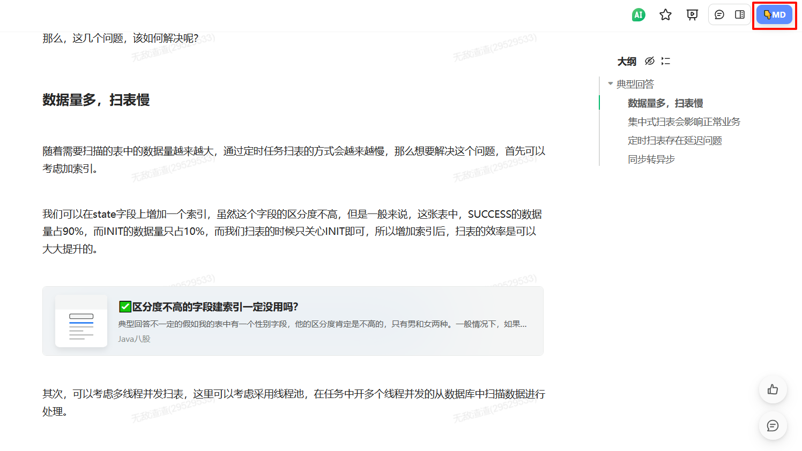

语雀下载脚本，适用于油猴脚本（浏览器插件）。
将语雀文档导出为Markdown格式，在文档右上角增加下载按钮。无视协作文档限制，依然可以下载。

此脚本在原作基础上增加内置卡片链接的处理。

脚本地址：
https://greasyfork.org/zh-CN/scripts/536358-%E8%AF%AD%E9%9B%80%E5%AF%BC%E5%87%BAmarkdown-plus%E7%89%88-yuque-download-to-markdown

此脚本在原作基础上增加内置卡片链接的处理。

原作链接：

https://greasyfork.org/zh-CN/scripts/534465-%E8%AF%AD%E9%9B%80%E5%AF%BC%E5%87%BA%E4%B8%BAmarkdown-yuque-download-to-markdown

## 页面截图

安装后，刷新页面，右上角会多出一个下载Markdown的按钮，如下图：

内置卡片链接的处理效果

